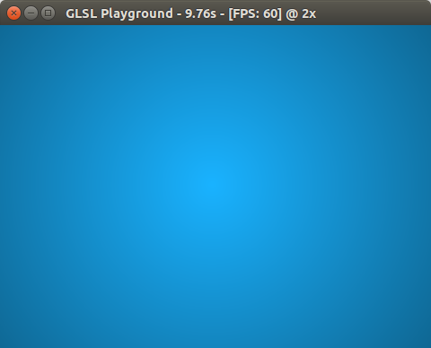

# GLSL Playground

A simple program written in C++ that reads a fragment shader and shades it to the screen. Has basic compatibility with GLSL Sandbox (Heroku) and Shadertoy fragment shaders.

## Dependencies

* GLFW3 (tested and works on `3.3.1` on `Ubuntu 18.04 LTS`)

## Compile & Run
Run `make` to compile the program. Once it is compiled, type in your shader in the `playground.fsh` file and run the executable to see it in action.

    ./glsl_playground [width height]

## Inputs
[GLSL Sandbox (Heroku)](https://github.com/mrdoob/glsl-sandbox)

    // returns the dimensions of the window
    uniform vec2 resolution

    // returns the mouse position in the interval [0.0, 1.0] for .xy.
    // origin is at bottom-left
    uniform vec2 mouse

    // returns the time in seconds from when the program started
    uniform float time

[Shadertoy](https://www.shadertoy.com/)

    // returns the dimensions of the window
    uniform vec3 iResolution

    // returns the mouse coordinates (when clicked) for .xy
    // and the mouse coordinates from last mouse press for .zw
    // origin is at bottom-left
    uniform vec4 iMouse

    // returns the time in seconds from when the program started
    uniform float iTime
    
Note: Please do not type Shadertoy uniform declarations in your shader as they are already included in the `shader_toy_inputs.fsh` file.

## What it can do
* Read and execute custom fragment shaders
* Works with some GLSL Heroku and Shadertoy shaders
* Display time in seconds and frames per second on the title window.
* (not yet implemented) Pressing 1-4 changes resolution factor (1x, 2x, 4x, 8x)
* Pressing R resets timer to zero. Pressing Shift + R reloads the shaders.
* Pressing the spacebar pauses/resumes GLSL Playground.
* Esc or closing the program through traditional means exits the program.

## TODO
* Learn more how OpenGL works (I'm a noob at this)
* Improve performance by optimizing code
* ~~Add pause function that can be done by pressing the space bar~~
* Implement resolution factor as seen in GLSL Heroku
* ~~Add ability to reload shader that can be done by pressing Shift + R~~
* Improve compatibility with GLSL Heroku and Shadertoy
* Add various geometry that can be used to test shaders on rather than simply rendering on the screen
* Add capability to read in multiple shaders, that can be navigated by pressing the cursor keys.

## Why do this?
#### Hasn't GLSL Heroku/Shadertoy have given you what you need?
This is purely a learning experience, to allow me to learn more about OpenGL and GLSL. I'm inspired from others who produce vivid shaders which is breathtaking and breaks a whole new level of algorithmic arts. GLSL is a powerful language, and I think it deserves a native program to get more people interested in this field. I chose C++ in hopes of achieving better performance and removing the overhead required to render the website; however I'm skeptical that my program can run significantly faster than GLSL Heroku or Shadertoy.

## License
This program is under `BSD 2-Clause` license.
